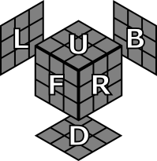

# Cubo de Rubik (3x3x3)

## Notación

Todas las posiciones del cubo en esta página se muestran desde la siguiente perspectiva.

## Algoritmos

* [Permutar tres aristas](#Permutar-tres-aristas)
* [Permutar tres esquinas](#Permutar-tres-esquinas)
* [Orientar dos aristas](#Orientar-dos-aristas)
* [Orientar dos esquinas](#Orientar-dos-esquinas)

### Permutar tres aristas

### Permutar tres esquinas

### Orientar dos aristas

### Orientar dos esquinas