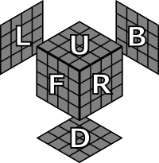
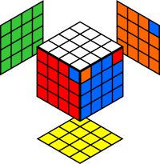
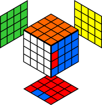
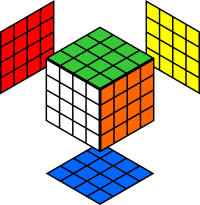

# Venganza de Rubik (4x4x4)

## Notación

Todas las posiciones del cubo en esta página se muestran desde la siguiente perspectiva.

## Algoritmos

* [Permutar tres aristas](#Permutar-tres-aristas)
* [Paridad (PLL)](#Paridad-PLL)

### Permutar tres aristas

> `[rUr', D2]`

Aunque las aristas pueden emparejarse de forma intuitiva tras hacer los centros, este conmutador permuta tres de ellas sin alterar el resto del cubo, lo que resulta muy útil para diseñar otros algoritmos. Este conmutador es el mismo que el del cubo 3x3x3 para permutar 3 aristas, cambiando los giros de la capa central `M` por giros de `r'` o `l`. En este caso, al tener dos aristas de cada color, también se puede aplicar el conmutador `[l'Ul, D2]` para permutar las aristas izquierdas.

Nótese que si dos de las aristas a permutar están juntas, se puede aplicar el conjugado `l^[rUr', D2]` o el conjugado `r'^[l'Ul, D2]`. Puede ser útil para permutar las 4 últimas aristas del cubo, si se quedan juntas 2 a 2.

### Paridad (PLL)

A la hora de permutar las piezas de la última capa, se puede presentar un caso de paridad de dos formas distintas: **i)** dos vértices intercambiados entre sí, o **ii)** dos esquinas intercambiadas entre sí.

 | 
:---: | :---:
**Paridad (aristas)** | **Paridad (esquinas)**

Aunque ambas situaciones pueden resolverse con el mismo algoritmo, en el segundo caso se requiere volver a hacer la última capa, ya que esta solución pasa por intercambiar las 4 aristas mal colocadas, 3 a 3. De hecho, es posible rehacer primero la cruz de la última capa, intercambiando dos de las aristas, colocar y orientar las esquinas. De esta forma, se llega al primer caso de paridad (de aristas).

Este algoritmo consta de dos partes. Ambas partes son conjugados del conmutador para [permutar tres aristas](#Permutar-tres-aristas). Tras aplicar el primer conmutador de la secuencia, se intercambian 3 aristas. Por comodidad, se realiza un giro del cubo completo en el eje `z`. Tras aplicar el segundo conmutador de la secuencia, las 3 últimas aristas son intercambiadas y el cubo queda resuelto.

> `((Rl)^[rUr', D2]) (z) ((L'r(D2))^[l'U'l, D2])`

 |  |  | 
:---: | :---: | :---: | :---:
Estado inicial | `(Rl)^[rUr', D2]` | `z` | `(L'r(D2))^[l'U'l, D2]`
