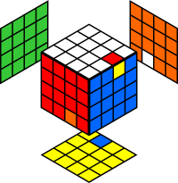
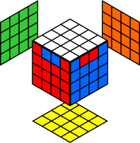
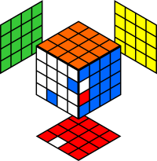
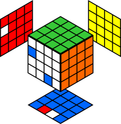

# Venganza de Rubik (4x4x4)

* [Permutar tres aristas](#Permutar-tres-aristas)
* [Paridad (PLL)](#Paridad-PLL)

## Permutar tres aristas

> [`r` `U` `r'`, `D2`]

Aunque casi todas las aristas pueden emparejarse de forma intuitiva tras hacer los centros, este conmutador intercambia tres de ellas sin alterar el resto del cubo, lo que resulta muy útil para diseñar otros algoritmos.

Este conmutador es el mismo que el del 3x3x3 para permutar 3 aristas, cambiando los giros de la capa central `M` por giros de `r'`. En este caso, al tener dos aristas de cada color, también se puede aplicar el conmutador [`l'` `U` `l`, `D2`] para permutar las aristas de la izquierda.

Nótese que si dos de las aristas a permutar están juntas, se puede aplicar el conjugado `r'` o `l`. Puede ser útil para permutar las 4 últimas aristas del cubo, si se quedan juntas 2 a 2.

## Paridad (PLL)

> ((`R` `l`)^[`r` `U` `r'`, `D2`]) (`z`) ((`L'` `r` `D2`)^[`l'` `U'` `l`, `D2`])

A la hora de permutar las piezas de la última capa, se puede presentar un caso de paridad de dos formas distintas: **i)** dos vértices intercambiados entre sí, o **ii)** dos esquinas intercambiadas entre sí. Aunque ambas situaciones pueden resolverse con el mismo algoritmo, en el segundo caso requerirá volver a hacer la última capa (orientar y permutar), ya que esta solución pasa por intercambiar las 4 aristas mal colocadas 3 a 3.

Este algoritmo consta de dos partes. Ambas partes son conjugados del conmutador para [permutar tres aristas](#Permutar-tres-aristas). Tras aplicar la secuencia (`R` `l`)^[`r` `U` `r'`, `D2`], se han intercambiado 3 aristas.

Por comodidad, se realiza un giro del cubo completo en el eje `z`.

Y finalmente, tras aplicar la secuencia (`L'` `r` `D2`)^[`l'` `U'` `l`, `D2`], las 3 últimas aristas son intercambiadas y el cubo queda resuelto.